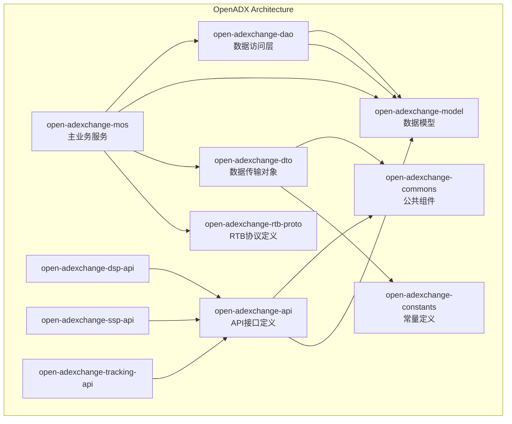

# OpenADX - 开放广告交易平台

OpenADX 是一个开放的广告交易平台，旨在连接 DSP（需求方平台）、SSP（供应方平台）和广告主，提供实时竞价（RTB）广告交易服务。

## 项目架构

OpenADX 采用微服务架构，主要包括以下模块：

### 核心模块

- **open-adexchange-api** - API 接口定义模块，包含 DSP、SSP 和 Tracking 接口定义
  - [open-adexchange-dsp-api](open-adexchange-api/open-adexchange-dsp-api/) - DSP 平台 API 接口定义
  - [open-adexchange-ssp-api](open-adexchange-api/open-adexchange-ssp-api/) - SSP 平台 API 接口定义
  - [open-adexchange-tracking-api](open-adexchange-api/open-adexchange-tracking-api/) - 广告追踪 API 接口定义

- **[open-adexchange-mos](open-adexchange-mos/)** - 主业务服务模块，包含广告交易的核心业务逻辑

- **[open-adexchange-model](open-adexchange-model/)** - 数据模型模块，定义领域实体和数据传输对象

- **[open-adexchange-dao](open-adexchange-dao/)** - 数据访问层，基于 MyBatis-Flex 实现数据持久化

- **[open-adexchange-dto](open-adexchange-dto/)** - 数据传输对象模块，定义接口实体

- **[open-adexchange-commons](open-adexchange-commons/)** - 公共组件模块，包含通用工具类和服务

- **[open-adexchange-constants](open-adexchange-constants/)** - 常量定义模块，包含系统常量和枚举

- **[open-adexchange-rtb-proto](open-adexchange-rtb-proto/)** - RTB 协议定义模块，包含实时竞价协议定义

### 代码生成模块

- **[open-adexchange-codegen](open-adexchange-codegen/)** - 代码生成模块，包含 MyBatis-Flex 代码生成器

## 模块依赖关系图



## 项目特色

- **SPI 扩展机制** - 支持多种 DSP 协议扩展，包括协议转换、宏替换、价格编解码等功能
- **实时竞价** - 支持基于 Protocol Buffers 的高效 RTB 协议
- **安全认证** - 采用基于 HmacSHA256 的安全认证机制
- **灵活配置** - 支持多租户和多 DSP 定制化配置

## 技术栈

- Java 21
- Spring Boot 3.4+
- MyBatis-Flex
- Protocol Buffers
- MySQL
- Redis
- Maven

## 文档资源

### 核心文档

- [广告引擎扩展点说明文档](广告引擎扩展点说明文档.md) - 介绍广告引擎的扩展点机制
- [OAX 广告引擎 SPI 说明文档](oax广告引擎spi说明文档.md) - 详细说明 SPI 扩展机制
- [价格加解密文档](价格加解密.md) - 介绍竞价价格的安全加解密机制

### API 文档

- [OAX-DSP-API对接文档](open-adexchange-api/open-adexchange-dsp-api/docs/OAX-DSP-API对接文档.md) - DSP 平台 API 对接说明
- [OAX_RTB 接口规范](open-adexchange-api/open-adexchange-dsp-api/docs/OAX_RTB_接口规范.md) - 实时竞价协议规范

### 服务端 API 文档

- [OAX-PUBLISHER-API接口文档](open-adexchange-api/open-adexchange-ssp-api/docs/OAX-PUBLISHER-API接口文档.md) - SSP 平台 API 对接说明
- [Publisher API 规范](open-adexchange-api/open-adexchange-ssp-api/docs/oax-publisher-api.proto) - Publisher 接入协议定义

## 快速开始

### 环境要求

- Java 21+
- Maven 3.8+
- MySQL 8.0+
- Redis

### 构建项目

```bash
# 克隆项目
git clone https://github.com/javagossip/open-adexchange.git

# 进入项目目录
cd open-adx

# 构建项目
./mvnw clean install -DskipTests
```

### 运行服务

```bash
# 启动主服务
cd open-adexchange-mos
../mvnw spring-boot:run
```

## 贡献

欢迎提交 Issue 和 Pull Request 来帮助我们改进 OpenADX。

## 许可证

Apache License 2.0